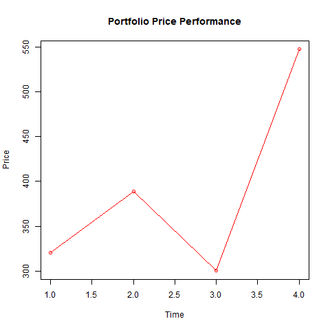
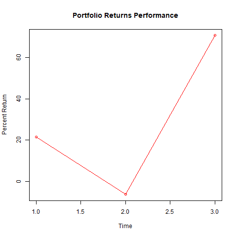

\newpage

```{r, include=FALSE, eval=FALSE}

# RUN THIS CHUNK TO GENERATE A BOOKDOWN PDF DOC, OTHERWISE, KNIT TO PDF
knitr::opts_chunk$set(echo = TRUE)
library(tinytex)
library(bookdown);
library(rmarkdown);
library(kableExtra);
rmarkdown::render("A-Graph-Chart-Playground.Rmd", "pdf_book")

```

```{r loadingPackages, include=FALSE, message=FALSE, warning=FALSE}

library(kableExtra, quietly=TRUE)
library(ROI, quietly=TRUE)             
library(ROI.plugin.glpk, quietly=TRUE) 
library(ompr, quietly=TRUE)            
library(ompr.roi, quietly=TRUE)
library(TRA, quietly=TRUE)
library(rsvg, quietly=TRUE)
library(DiagrammeR, quietly=TRUE)
library(DiagrammeRsvg, quietly=TRUE)
library(tidyverse, quietly=TRUE)
library(lessR, quietly=TRUE)
library(ggplot2, quietly=TRUE)
library(RMySQL, quietly=TRUE)
library (MultiplierDEA, quietly=TRUE)
options(digits = 2)

```

```{r configureParams, echo=FALSE, message=FALSE}

# AVAILABLE SECTORS:
#   Technology
#   Basic Materials
#   Consumer Discretionary
#   Consumer Staples
#   Energy
#   Finance
#   Health Care
#   Industrials
#   Real Estate
#   Telecommunications
#   Utilities

############################
#
SECTOR <- 'Basic Materials'
FiscalYear <- '2015'
StartDate <- '2014-12-31'
EndDate <- '2016-01-01'
#
############################

```

# `r SECTOR` Sector

```{r LoadDataMySQL, echo=FALSE, message=FALSE}

# CONNECT TO MYSQL DATABASE
mydb = dbConnect(MySQL(), 
                 user='vsc', 
                 password='blaster123', 
                 dbname='stock', 
                 host='127.0.0.1')

# SHOW ALL TABLE IN THE CONNECTED DATABASE
#print("Show all tables in the connected database:")
#dbListTables(mydb)

# SHOW ALL FIELDS IN EACH OF TABLE
#print("Show all fields in the 'securities' table:")
#dbListFields(mydb, 'securities')
#print("Show all fields in the 'financials' table:")
#dbListFields(mydb, 'financials')
#print("Show all fields in the 'price_quotes' table:")
#dbListFields(mydb, 'price_quotes')
#print("Show all fields in the 'sp500' table:")
#dbListFields(mydb, 'sp500')
#print("Show all fields in the 'beta_sigma' table:")
#dbListFields(mydb, 'beta_sigma')

# GET RESULTS FROM A QUERY (DQL EXAMPLE)
#rs = dbSendQuery(mydb, "select * from sp500")
#data = fetch(rs, n=-1) # GET THE DATA FROM THE QUERY RESULTS

sql_select <- sprintf("
SELECT DISTINCT p.symbol AS 'DMU',
b.beta AS 'Beta', b.sigma AS 'Sigma', f.debtToEquity AS 'DToE', 
f.pToBv AS 'PToB', f.netIncomeToRevenue AS 'NetMrgn', 
f.incomeNetPerWabso AS 'EPS', f.returnOnAssets AS 'ROA', 
f.returnOnEquity as 'ROE', b.rate_of_return as 'TTMreturn',
b.investment_entry_price AS 'entryPrice', b.one_year_price AS 'oneYRprice', b.three_year_price AS 'threeYRprice',
b.five_year_price AS 'fiveYRprice', Sector as 'Sector'
FROM price_quotes p, financials f, beta_sigma b, securities s
WHERE p.Symbol = b.Symbol AND p.Symbol = f.Symbol AND p.symbol = s.Symbol
AND p.date > '%s' AND p.date < '%s'
AND f.fiscalYear='%s'
AND b.one_year_price IS NOT NULL
AND b.three_year_price IS NOT NULL
AND b.five_year_price IS NOT NULL
AND f.returnOnEquity IS NOT NULL
AND f.debtToEquity != 0
AND s.Sector = '%s'", StartDate, EndDate, FiscalYear, SECTOR);

rs = dbSendQuery(mydb, sql_select)
df = fetch(rs, n=-1) # GET THE DATA FROM THE QUERY RESULTS

db_temp <- dbClearResult(rs) # FLUSH THE BUFFER, RESULTS INTO TEMP VAR
#db_temp <- dbDisconnect(mydb) # CLOSE THE DATABASE CONNECTION, RESULTS IN TEMP

# RUN A MODIFY QUERY (DML EXAMPLE)
#dbSendQuery(mydb, 'drop table if exists some_table, some_other_table')

# RUN A DATA DEFINITION COMMAND TO CREATE A TABLE FROM A DATAFRAME (DDL EXAMPLE)
#dbWriteTable(mydb, name='table_name', value=data.frame.name)

# READ CSV FILE FOR SP500 DATA
#sp500 <- read.csv("SP500-Return-Calculation-Dates.csv")

```


```{r CleanData, echo=FALSE, message=FALSE}

# CONVERT DATFRAME TO MATRIX FOR PROCESSING
converted_data <- data.matrix(df, rownames.force=NA)

# GET THE X AND Y VARIABLES FOR DEA
x <- data.matrix(converted_data[,2:5])  # ALL ROWS, COLS 2,3,4,5
y <- data.matrix(converted_data[,6:10]) # ALL ROWS, COLS 6,7,8,9,10

# SET THE DMU NAMES
DMUnames <- df[,1] # ALL ROWS, COL 1

# GET THE PRICE VALUES AT THE END OF EACH BACKTESTING HOLDING DATES
oneThreeFiveYRprices <- df[,11:14] # ALL ROWS, COLS 11,12,13,14

# BUILD DATAFRAME FOR BACKTESTING TIME FRAME PRICE VALUES
backtestingPrices <- cbind(DMUnames, oneThreeFiveYRprices)

```

## 1, 3, 5 Year DEA Portfolio Performance Analysis

*Only 100% \index{efficient stocks} efficient stocks identified through DEA analysis are included
for the constructed portfolio.*

```{r GenerateCRS, echo=FALSE, message=FALSE}

#####################################################
# CONSTANT RETURNS TO SCALE MODEL
#####################################################

# SET THE LOOP COUNT AND DATA VARIABLE SIZES
NX <- ncol(x); NY <- ncol(y); ND <- nrow(x)
xdata <- x[1:ND,]
dim(xdata) <- c(ND, NX) 
ydata <- y[1:ND,]
dim(ydata) <- c(ND, NY)

# SETUP THE MODEL
results.efficiency <- matrix(rep(-1.0, 1), nrow=ND, ncol=1)
results.lambda     <- matrix(rep(-1.0, ND), nrow=ND,ncol=ND)

for (k in 1:ND) {

  results <- MIPModel()                                              |>
    add_variable(Vlambda[j], j = 1:ND, type = "continuous", lb = 0) |>
    add_variable(Vtheta, type = "continuous")                       |>
    set_objective(Vtheta, "min")                                    |>
    add_constraint(sum_expr(Vlambda[j] * xdata[j,i], j = 1:ND) 
                   <= Vtheta * xdata[k,i], i = 1:NX)                |>
    add_constraint(sum_expr(Vlambda[j] * ydata[j,r], j = 1:ND) 
                   >= ydata[k,r], r = 1:NY)                         |>
    solve_model(with_ROI(solver = "glpk")) 
  
#  print(c("DMU=",k,solver_status(results)))
  
  results.efficiency[k] <-  get_solution(results, Vtheta)       
  results.lambda[k,] <- t(as.matrix(as.numeric(
    get_solution(results, Vlambda[j])[,3] )))
}

temp_CRS <- cbind(DMUnames,
              results.efficiency)

colnames(temp_CRS) <- c("DMU","Efficiency Score")

temp_CRS_Basic_Materials <- temp_CRS

# SLICE OFF ONLY THE STOCKS THAT HAVE AN EFFICIENCY OF ONE (1)
only_efficient_stocks_CRS <- temp_CRS[temp_CRS[,2] >= 1.0,]

# SELECT PRICE INFORMATION FOR ALL EFFICIENT STOCKS
# USE THE DATA TO PROVIDE ADDITIONAL METRICS AND CHARTS
#
# SELECT * 
# FROM PRICES
# WHERE symbol IN [x]  /* x = All Efficient Stocks (by DMU) */
#

# CREATE A VECTOR OF SYMBOLS IN THE ONLY_EFFICIENT DATAFRAME
vec <- only_efficient_stocks_CRS[,1]
fvec <- sQuote(vec) # SINGLE QUOTE EACH SYMBOL IN THE VECTOR
# CREATE A COMMA SEPARATED LIST
comma_vec <- paste(fvec, collapse = ", ")
# PASTE THE LIST TOGETHER FOR USE IN THE SQL STATEMENT IN CLAUSE
vec_mod = paste(vec, collapse=",")

# GET ALL PRICES WITHIN ANALYSIS TIME FRAME FOR ALL EFFICIENT STOCKS
sql_select <- sprintf("
SELECT * FROM price_quotes
WHERE Symbol IN (%s)
AND date > '%s' AND date < '%s'", 
comma_vec, StartDate, EndDate);

rs = dbSendQuery(mydb, sql_select) # RUN THE QUERY
df_prices = fetch(rs, n=-1) # GET THE DATA FROM THE QUERY RESULTS

colnames(df_prices) <- c('index','date','open','high','low','close','volume','DMU','file')


db_temp <- dbClearResult(rs) # FLUSH THE BUFFER, RESULTS INTO TEMP VAR
db_temp <- dbDisconnect(mydb) # CLOSE THE DATABASE CONNECTION, RESULTS IN TEMP

```

```{r CalculateReturnRates, echo=FALSE, message=FALSE}

# FUNCTION TO CALCULATE THE RATE OF RETURN BETWEEN TWO PRICES
rateOfReturn <- function(endPrice, startPrice){
    format(round(as.numeric(((endPrice - startPrice) / startPrice)*100), 2), nsmall=2)
}

# CALCULATE THE ONE YEAR RATE OF RETURN
oneYRreturnRate <- rateOfReturn(backtestingPrices$oneYRprice, backtestingPrices$entryPrice)

# CALCUALTE THE THREE YEAR RATE OF RETURN
threeYRreturnRate <- rateOfReturn(backtestingPrices$threeYRprice, backtestingPrices$entryPrice)

# CALCULATE THE FIVE YEAR RATE OF RETURN
fiveYRreturnRate <- rateOfReturn(backtestingPrices$fiveYRprice, backtestingPrices$entryPrice)

# BIND EACH CALCULATED RATE OF CHANGE AS COLUMNS
returnResults <- cbind(DMUnames, 
                       backtestingPrices$entryPrice,
                       backtestingPrices$oneYRprice, 
                       backtestingPrices$threeYRprice,
                       backtestingPrices$fiveYRprice,
                       oneYRreturnRate, 
                       threeYRreturnRate, 
                       fiveYRreturnRate)

# SET THE COLUMN NAMES OF THE RATE OF RETURN RESULTS
colnames(returnResults) <- c("DMU",
                             "entryPrice",
                             "oneYRprice",
                             "threeYRprice",
                             "fiveYRprice",
                             "OneYR",
                             "ThreeYR",
                             "FiveYR")

# MERGE THE EFFICIENT DMU DATAFRAME WITH THE RATE OF RETURN RESULT DATAFRAME
# NOTE: INNER JOIN BY DMU NAME
df_all = merge(x = only_efficient_stocks_CRS, y = returnResults, by = "DMU")

# CREATE THE CAPTION FOR THE REPORT USING THE SECTOR NAME SELECTED FOR STUDY
report_caption <- sprintf('%s Sector Portfolio Detail', toupper(SECTOR))

# OUTPUT THE DMU, EFFICENCY SCORE, AND RATE OF RETURNS
kbl(df_all, align = "lcrrrrrrr", booktabs=T, digits=3, escape=T, row.names=F,
    col.names=c("DMU", "Score", "Entry", "1 YR" ,"3 YR" ,"5 YR" , "1 YR", "3 YR", "5 YR"),
  caption= report_caption) |>
  add_header_above(c(" " = 1, "Efficiency" = 1, "Stock Prices ($)" = 4, "Holding Period Returns (%)" = 3))  |>
  kable_styling(latex_options = "HOLD_position")


############################################################################
# GET THE CROSS-EFFICIENCY SCORES FROM THE MULTIPLIERDEA LIBRARY FUNCTION
############################################################################
eff_result <- DeaMultiplierModel(xdata, ydata , "crs", "input")
cross_result <- CrossEfficiency(xdata, ydata, "crs", "input")
rownames(eff_result$Efficiency) <- DMUnames
###########################################################################

# MERGE THE EFFICIENT DMU DATAFRAME WITH THE RATE OF RETURN RESULT DATAFRAME
# NOTE: INNER JOIN BY DMU NAME
#df_cross = merge(x = only_efficient_stocks_CRS, y = cross_result$ce_ave, by = "DMU")

# SHOW ALL EFFICIENCY SCORE RESULTS
#kbl (eff_result$Efficiency, caption="CRS Efficiency Scores for All in Selected Sector", 
#     booktabs = T, digits = 3, align = 'c') |>
#  kable_styling(latex_options = c("HOLD_position"))

# kbl (eff_result, align = "c", booktabs = T, digits = 4,
#      caption="Cross-Efficiency Scores") |>
#   kable_styling(latex_options = c("HOLD_position"))


# CALCULATE NUMERICAL PRICE RETURNS
averageEntry <- format(sum(as.numeric(df_all$entryPrice)), digits=2, nsmall=2)
average1YRp <- format(sum(as.numeric(df_all$oneYRprice)), digits=2, nsmall=2)
average3YRp <- format(sum(as.numeric(df_all$threeYRprice)), digits=2, nsmall=2)
average5YRp <- format(sum(as.numeric(df_all$fiveYRprice)), digits=2, nsmall=2)

# CALCULATE THE ONE YEAR RATE OF RETURN
average1YR <- format((((as.numeric(average1YRp) - as.numeric(averageEntry)) 
               / as.numeric(averageEntry))*100), digits=2, nsmall=2)

# CALCUALTE THE THREE YEAR RATE OF RETURN
average3YR <- format((((as.numeric(average3YRp) - as.numeric(averageEntry)) 
               / as.numeric(averageEntry))*100), digits=2, nsmall=2)

# CALCULATE THE FIVE YEAR RATE OF RETURN
average5YR <- format((((as.numeric(average5YRp) - as.numeric(averageEntry)) 
               / as.numeric(averageEntry))*100), digits=2, nsmall=2)

# BUILD THE OUTPUT DATA
sector_average_text <- sprintf('%s', SECTOR)
sector_CRS_averages <- cbind(sector_average_text, 
                             averageEntry, average1YRp, average3YRp, average5YRp, 
                             average1YR, average3YR, average5YR)

# CREATE THE CAPTION FOR THE REPORT USING THE SECTOR NAME SELECTED FOR STUDY
report_caption <- sprintf('%s Sector Portfolio Summary', toupper(SECTOR))

kbl(sector_CRS_averages, align = "lrrrrrrr", booktabs=T, digits=3, escape=T, 
    row.names=F, longtable=T,
    col.names=c(" ", "Entry", "1 YR", "3 YR", "5 YR", "1 YR", "3 YR", "5 YR"),
    caption= report_caption) |>
  add_header_above(c(" " = 1, "Porfolio Value ($)" = 4, "Holding Period Returns (%)" = 3))  |>
  kable_styling(latex_options = "HOLD_position")

```

\newpage

## Graphs and Charts

```{r PriceGraphs, echo=FALSE, message=FALSE}

df2 <- data.frame(df_all)

df2$OneYR = as.numeric(as.character(df2$OneYR))

entry_price_val <- as.numeric(df_all$entryPrice)
exit_1YR_price_val <- as.numeric(df_all$oneYRprice)
exit_3YR_price_val <- as.numeric(df_all$threeYRprice)
exit_5YR_price_val <- as.numeric(df_all$fiveYRprice)

# BAR CHART, HORIZONTAL BARS, DESCENDING SORT
#BarChart(DMU, y=price_val, stat="mean", data=df_all, digits_d=2, horiz=FALSE, sort="-")
#BarChart(DMU, y=exit_1YR_price_val, stat="mean", data=df_all, digits_d=2, horiz=FALSE, sort="-")
#BarChart(DMU, y=exit_3YR_price_val, stat="mean", data=df_all, digits_d=2, horiz=FALSE, sort="-")
#BarChart(DMU, y=exit_5YR_price_val, stat="mean", data=df_all, digits_d=2, horiz=FALSE, sort="-")

# CLEVELAND DOT PLOT, DESCENDING ORDER
#Plot(DMU, data=df2, stat="count", sort="-")

#Plot(OneYR, DMU, data=df2)

# COMMA SEPARATED LIST OF STOCK SYMBOLS CREATED IN PORTFOLIO ANALYSIS SECTION
#for (x in comma_vec) {
#  df_price_CRS = merge(x = only_efficient_stocks_CRS, y = df_prices, by = "DMU")
#  plot(df_price_CRS$date, df_price_CRS$close)
#}


# Create the data for the chart.
#v <- df_all$entryPrice
v <- sector_CRS_averages[,2:5]
t <- sector_CRS_averages[,6:8]
#t <- sector_CRS_averages

# Give the chart file a name.
png(file = "line_chart_prices.png")
# Plot the bar chart.
plot(v, type = "o",col = "red", xlab = "Time", ylab = "Price", 
   main = "Portfolio Price Performance")
lines(t, type = "o", col = "blue")
# Save the file.
invisible(capture.output(dev.off()))
#dev.off()
# INCLUDE THE FILE

```

\newpage

```{r PercentReturnCharts, echo=FALSE, message=FALSE}
# Create the data for the chart.
v <- sector_CRS_averages[,6:8]
t <- sector_CRS_averages[,2:5]
#v <- sector_CRS_averages[,2:5]
#t <- sector_CRS_averages[,6:8]

# Give the chart file a name.
png(file = "line_chart_returns.png")
# Plot the bar chart.
plot(v, type = "o",col = "red", xlab = "Time", ylab = "Percent Return", 
   main = "Portfolio Returns Performance")
lines(t, type = "o", col = "blue")
# Save the file.
invisible(capture.output(dev.off()))
#dev.off()
# INCLUDE THE FILE


d <- df_prices
HistClosePrice <- as.numeric(df_prices$close)
Histogram(HistClosePrice, bin_width=5, quiet=TRUE)

#d <- df_all
#HistEntryPrice <- as.numeric(df_all$entryPrice)
#Histogram(HistEntryPrice, bin_width=30, quiet=TRUE)

#Hist1YRPrice <- as.numeric(df_all$oneYRprice)
#Histogram(Hist1YRPrice, bin_width=30, quiet=TRUE)

#Hist3YRPrice <- as.numeric(df_all$threeYRprice)
#Histogram(Hist3YRPrice, bin_width=30, quiet=TRUE)

#Hist5YRPrice <- as.numeric(df_all$fiveYRprice)
#Histogram(Hist5YRPrice, bin_width=30, quiet=TRUE)

```

\newpage

## Data Source Examination

```{r ExploreData, echo=FALSE, message=FALSE}

# SET THE HEAD AND TAIL DIVIDERS
xdivider <- data.frame(DMU=c('---'), Beta=c('---'), Sigma=c('---'), DToE=c('---'), PToB=c('---'))
ydivider <- data.frame(DMU=c('---'), NetMrgn=c('---'), EPS=c('---'), ROA=c('---'), ROE=c('---'), TTMreturn=c('---'))

xx <- head(cbind(df['DMU'], x)) # SELECT THE FIRST FEW LINES FROM THE DATA
xxt <- tail(cbind(df['DMU'], x))
xxd <- rbind(xx,xdivider,xxt)

yy <- head(cbind(df['DMU'], y))
yyt <- tail(cbind(df['DMU'], y))
yyd <- rbind(yy,ydivider,yyt)

# SHOW THE INPUT VARIABLE EXAMPLES
kbl(xxd, booktabs=T, digits=3, escape=T, row.names=F, longtable=T,
    col.names=c("DMU","Beta", "Sigma", "Debt To Equity","Price to Book"),
    caption= 'Data Source Extract Example - INPUTS ($x$)')  |>
  kable_styling(latex_options = "HOLD_position")

# SHOW THE OUTPUT VARIABLE EXAMPLES
kbl(yyd, booktabs=T, digits=3, escape=T, row.names=F, longtable=T,
    col.names=c("DMU","Net Margin","EPS", "Return on Assets", "Return on Equity",
                "Rate of Return"),
    caption= 'Data Source Extract Example - OUTPUTS ($y$)')  |>
  kable_styling(latex_options = "HOLD_position")

```

\newpage

## Multiplier Model Analysis

```{r MultiplierModelResultVariables, echo=FALSE, message=FALSE}

mm1.efficiency <- matrix(rep(-1.0, ND), nrow=ND)
mm1.lambda     <- matrix(rep(-1.0, ND^2), nrow=ND)
mm1.vweight    <- matrix(rep(-1.0, ND*NX), nrow=ND) 
mm1.uweight    <- matrix(rep(-1.0, ND*NY), nrow=ND) 
mm1.xslack     <- matrix(rep(-1.0, ND*NX), nrow=ND) 
mm1.yslack     <- matrix(rep(-1.0, ND*NY), nrow=ND) 

mm1names <- TRA::DEAnames(NX, NY, ND)

xnames <- c("Beta $v_1$", "Sigma $v_2$", "DtoE $v_3$", "PtoB $v_4$")
ynames <- c("NetMgn $u_1$", "EPS $u_2$", "ROA $u_3$", "ROE $u_4$", "TTM $u_5$")

```

```{r MuliplierModel, eval=TRUE, echo=FALSE, message=FALSE}

for (k in 1:ND) {

  result <- MIPModel() |>
  add_variable(vweight[i], i = 1:NX, type = "continuous", lb = 0)   |>
  add_variable(uweight[r], r = 1:NY, type = "continuous", lb = 0)   |>
  set_objective(sum_expr(uweight[r] * ydata[k,r], r = 1:NY), "max") |>
  add_constraint(sum_expr(vweight[i] * xdata[k,i], i = 1:NX) == 1)  |>
  add_constraint((sum_expr(uweight[r] * ydata[j,r], r = 1:NY)-
                    sum_expr(vweight[i] * xdata[j,i], i = 1:NX)) 
                 <= 0, j = 1:ND)
  result

  result <- solve_model(result, with_ROI(solver = "glpk", 
                                         verbose = FALSE))
  mm1.efficiency[k] <- objective_value (result) 

  # Get the output weights
  tempvweight <- get_solution(result, vweight[i])
  mm1.vweight[k,] <- tempvweight[,3]

  # Get the input weights
  tempuweight <- get_solution(result, uweight[i])
  mm1.uweight[k,] <- tempuweight[,3]
  templambda <- as.matrix(get_row_duals(result))
  mm1.lambda[k,] <- templambda [-1]
  # Drops the first dual value since that 
  #    constraint since is for setting denom=1
 }

mm1.input_wts  <- cbind(DMUnames,
                        format(mm1.efficiency, digits=2, nsmall=2),
                        format(mm1.vweight, digits=2, nsmall=2))
only_efficient_inputs <- mm1.input_wts[mm1.input_wts[,2] >= 1.0,]

mm1.output_wts <- cbind(DMUnames,
                        format(mm1.efficiency, digits=2, nsmall=2),
                        format(mm1.uweight, digits=2, nsmall=2))
only_efficient_outputs <- mm1.output_wts[mm1.output_wts[,2] >= 1.0,]

mm1.combined <- cbind (DMUnames,
                       format(mm1.efficiency, digits=2, nsmall=2), 
                       format(mm1.vweight, digits=2, nsmall=2), 
                       format(mm1.uweight, digits=2, nsmall=2))

mm1.combined_lambda <- cbind(DMUnames,
                       format(mm1.efficiency, digits=2, nsmall=2), 
                       format(mm1.lambda, digits=2, nsmall=2))

# SLICE OFF ONLY THE STOCKS THAT HAVE AN EFFICIENCY OF ONE (1)
only_efficient_stocks_MM <- mm1.combined[mm1.combined[,2] >= 1.0,]

efficient_MM <- only_efficient_stocks_MM[,3:11]
display_efficient_MM <- cbind(only_efficient_stocks_MM[,1], efficient_MM)

# TOO MANY LAMBDA VALUES TO VIEW IN A TYPICAL STOCK SECTOR DATA SET
#only_efficient_stocks_MM_labmda <- mm1.combined_lambda[mm1.combined_lambda[,2] >= 1.0,]

```

### Input/Output Weight Analysis

```{r MultiplierModelIOs, echo=FALSE, message=FALSE}

kbl (display_efficient_MM, booktabs=T, escape=F, digits=2, longtable=T,
     col.names=c("DMU", xnames, ynames),
     caption =c("Multiplier Model Results for Perfectly Efficient Stocks"))  |>
  add_header_above(c(" " = 1, "Inputs (x)" = 4, "Outputs (y)" = 5))  |>
  kable_styling (latex_options = c("HOLD_position"))

# kbl (only_efficient_stocks_MM_labmda, booktabs=T, escape=F, digits=2, longtable=F,
#      col.names=c("DMU", "$\\theta^{CRS}$", mm1names$LambdanamesbyletterLX),
#      caption =c("Multiplier Model Results"))  |>
#   kable_styling (latex_options = c("hold_position", "scale_down")) |>
#   landscape()

```

### Output Weight Analysis

```{r MultiplierModelOutputs, echo=FALSE, message=FALSE}

kbl (only_efficient_outputs, booktabs=T, escape=F, digits=2, longtable=T,
     col.names=c("DMU", "$\\theta^{CRS}$", ynames),
     caption =c("MM Output Weights for Perfectly Efficient Stocks"))  |>
  add_header_above(c(" " = 1, "Score" = 1, "Outputs (y)" = 5))  |>
  kable_styling (latex_options = c("HOLD_position"))

```

### Input Weight Analysis

```{r MultiplierModelInputs, echo=FALSE, message=FALSE}
kbl (only_efficient_inputs, booktabs=T, escape=F, digits=2, longtable=T,
     col.names=c("DMU", "$\\theta^{CRS}$", xnames),
     caption =c("MM Input Weights for Perfectly Efficient Stocks"))  |>
  add_header_above(c(" " = 1, "Score" = 1, "Inputs (x)" = 4))  |>
  kable_styling (latex_options = c("HOLD_position"))

```

\newpage

# Appendix

## Constant Returns to Scale Mathematical Model

$$
\begin{split}
\begin{aligned}
    \text{min  }   & \theta \\
    \text{s.t.:  } & \sum_{j=1}^{N^D} x_{i,j}\lambda_j - \theta x_{i,k} \leq 0 \; \forall \; i\\
                   & \sum_{j=1}^{N^D} y_{r,j}\lambda_j \geq  y_{r,k} \;  \forall \; r\\
                   & \lambda_j \geq 0  \; \forall \; j
  \end{aligned}
 \end{split}
$$

## Multiplier Mathematical Model

$$
\begin{split}
 \begin{aligned}
    \text {max   } & \sum_{r=1}^{N^Y} u_r y_{r,k} \\
    \text{s.t.:  } & \sum_{i=1}^{N^X} v_i x_{i,k} = 1 \\
    & \sum_{r=1}^{N^Y} u_r y_{r,j} - \sum_{i=1}^{N^X} v_i x_{i,j} 
                          \leq 0 \; \forall \; j\\
                   &  u_r, \; v_i\geq 0  \; \forall \; r,i
  \end{aligned}
 \end{split}
$$

\printindex
